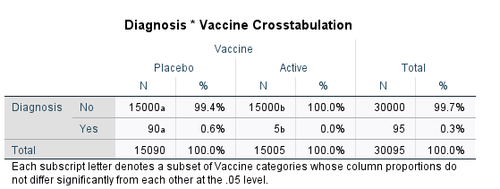
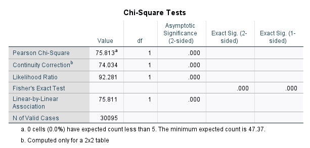
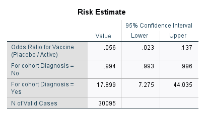
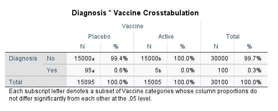
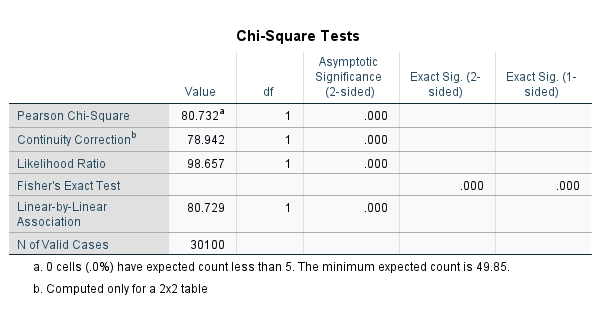
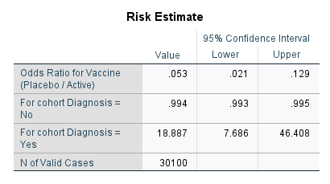
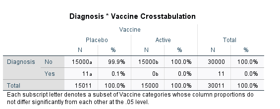
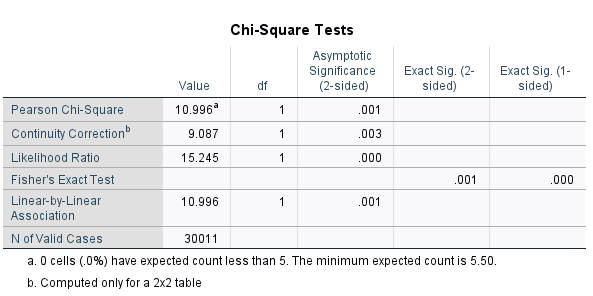

```{r setup, include=FALSE}
knitr::opts_chunk$set(echo = TRUE)
library(tidyverse)
library(kableExtra)
```

Good News!  In November, both Pfizer and Moderna announce Phase 3 Vaccine Trials with promising results.

With over 30,000 participants in each study they reported the following data.

```{r data}
covidVaccines <- tibble(
  Treatment=c("Placebo","Vaccine"),
  Pfizer=c(90,5),ModernaAll=c(95,5),
  ModernaSevere=c(11,0),
  N=c(15000,15000))
covidVaccines.N <- 15000
kable(covidVaccines)
```
## Measures of Effectiveness

We start with a cross-tab

Treatment | Sick | Healthy | Total
--------- | ---- | ------- | -----
Placebo   |  SP  |   HP    |  NP
Vaccine   |  SV  |   HV    |  NV
Total     |  NS  |   NH    |  N

Odds of getting sick

Placebo:  $ SP/HP $
Vaccine:  $ SV/HV $


### Cross Product (Odds) Ratio

$$ OR = \frac{SP/HP}{SV/HV} $$
How much does your odds of getting sick increase if you get the placebo instead of the vaccine.

### Risk Ratio

$$ RR = \frac{SP/NP}{SV/NV} $$
How much does your probiliby of getting sick increase if you get the placebo instead of the vaccine.

### Vaccine Effectiveness

$$ VE = 100 (1 - \frac{1}{RR}) $$

### Chi-square test

Null hypothesis is that getting the disease is independent of the vaccine.  In other words, $OR=RR=1$.

$$ SV/NV = SP/NP $$

Large chi-squared value incidates that cross product rate is not 1 (but doesn't tell if placebo or vaccine is better!

### Z-score test

Another way to work with these data is to calculate probabilities of infection for each group and the standard errors.  Then can use the $z$-test to compare.

$$p_V = p(S|V) = SV/NV \qquad SE(p_V) = \sqrt{p_V(1-p_V)/NV} $$
$$p_P = p(S|P) = SP/NP \qquad SE(p_P) = \sqrt{p_P(1-p_P)/NP} $$
$$ z = \frac{p_P-p_V}{\sqrt{SE(p_V)^2 + SE(p_P)^2}}$$

## Pfizer Vaccine

There were around 30,000 volunteers in the Phase 3 trials; 15,000 in each arm.

```{r}

covidVaccines %>% 
  mutate(p.Pfizer=Pfizer/N) %>%
  mutate(s.Pfizer=sqrt(p.Pfizer*(1-p.Pfizer)/N)) ->
  covidVaccines

select(covidVaccines,Treatment,contains("Pfizer")) %>% kable(digits=c(4,5))
              

```
```{r}
ggplot(covidVaccines,aes(x=Treatment,y=p.Pfizer,ymin=p.Pfizer-2*s.Pfizer,ymax=p.Pfizer+2*s.Pfizer)) + geom_pointrange()
```
### X^2 -- Pfizer

In SPSS this is done by producing a cross-tab.  We don't have the number of negative cases in each arm of the study, but up to rounding error it is just the sample size, so we will use that.




```{r}
chisq.test(as.matrix(select(covidVaccines,Pfizer,N)))
```

```{r}
p <- pull(covidVaccines,p.Pfizer)
s <- pull(covidVaccines,s.Pfizer)

z <- (p[1]-p[2])/sqrt(sum(s^2))
pz <- 1-pnorm(z)
cat("Z = ",round(z,2), "p = ",round(pz,3),"\n")

```




```{r}
p <- pull(covidVaccines,p.Pfizer)
RR <- p[1]/p[2]
VE <- 100*(1-1/RR)
cat("Risk Ratio: ",round(RR,2),
    "Vaccine Effectiveness: ",round(VE,1),"\n")

```


## Moderna Vaccine -- All Cases


There were around 30,000 volunteers in the Phase 3 trials; 15,000 in each arm.

```{r}

covidVaccines %>% 
  mutate(p.ModernaAll=ModernaAll/N) %>%
  mutate(s.ModernaAll=sqrt(p.ModernaAll*(1-p.ModernaAll)/N)) ->
  covidVaccines

select(covidVaccines,Treatment,contains("ModernaAll")) %>% kable(digits=c(4,5))
              

```
```{r}
ggplot(covidVaccines,aes(x=Treatment,y=p.ModernaAll,ymin=p.ModernaAll-2*s.ModernaAll,ymax=p.ModernaAll+2*s.ModernaAll)) + geom_pointrange()
```
### X^2 -- Moderna (All Cases)

In SPSS this is done by producing a cross-tab.  We don't have the number of negative cases in each arm of the study, but up to rounding error it is just the sample size, so we will use that.




```{r}
chisq.test(as.matrix(select(covidVaccines,ModernaAll,N)))
```

```{r}
p <- pull(covidVaccines,p.ModernaAll)
s <- pull(covidVaccines,s.ModernaAll)

z <- (p[1]-p[2])/sqrt(sum(s^2))
pz <- 1-pnorm(z)
cat("Z = ",round(z,2), "p = ",round(pz,3),"\n")

```




```{r}
p <- pull(covidVaccines,p.ModernaAll)
RR <- p[1]/p[2]
VE <- 100*(1-1/RR)
cat("Risk Ratio: ",round(RR,2),
    "Vaccine Effectiveness: ",round(VE,1),"\n")

```

## Moderna Vaccine -- Severe Cases


```{r}

covidVaccines %>% 
  mutate(p.ModernaSevere=ModernaSevere/N) %>%
  mutate(s.ModernaSevere=sqrt(p.ModernaSevere*(1-p.ModernaSevere)/N)) ->
  covidVaccines

select(covidVaccines,Treatment,contains("ModernaSevere")) %>% kable(digits=c(4,5))
              

```
```{r}
ggplot(covidVaccines,aes(x=Treatment,y=p.ModernaSevere,ymin=p.ModernaSevere-2*s.ModernaSevere,ymax=p.ModernaSevere+2*s.ModernaSevere)) + geom_pointrange()
```
### X^2 -- Moderna (All Cases)

In SPSS this is done by producing a cross-tab.  We don't have the number of negative cases in each arm of the study, but up to rounding error it is just the sample size, so we will use that.




```{r}
chisq.test(as.matrix(select(covidVaccines,ModernaSevere,N)))
```

```{r}
p <- pull(covidVaccines,p.ModernaSevere)
s <- pull(covidVaccines,s.ModernaSevere)

z <- (p[1]-p[2])/sqrt(sum(s^2))
pz <- 1-pnorm(z)
cat("Z = ",round(z,2), "p = ",round(pz,3),"\n")

```

```{r}
p <- pull(covidVaccines,p.ModernaSevere)
RR <- p[1]/p[2]
VE <- 100*(1-1/RR)
cat("Risk Ratio: ",round(RR,2),
    "Vaccine Effectiveness: ",round(VE,1),"\n")

```

Yikes!  The estimate for the chances of getting Severe Covid-19 with
the virus is 0.  Divide by zero error!

But probability zero means impossible.  That is not right!

### Continuity Correction

Fix this by adding a conditinuity correction.  We add 1/2 to all of
the entries in the table.  

In particular, this makes the estimated
rate for getting severe COVID-19 $\frac{1}{2}/(N+1)$.

```{r}

covidVaccines %>% 
  mutate(p.ModernaSevere=(ModernaSevere+.5)/(N+1)) %>%
  mutate(s.ModernaSevere=sqrt(p.ModernaSevere*(1-p.ModernaSevere)/(N+1))) ->
  covidVaccines

select(covidVaccines,Treatment,contains("ModernaSevere")) %>% kable(digits=c(5,5))
              

```
```{r}
ggplot(covidVaccines,aes(x=Treatment,y=p.ModernaSevere,ymin=p.ModernaSevere-2*s.ModernaSevere,ymax=p.ModernaSevere+2*s.ModernaSevere)) + geom_pointrange()
```
```{r}
p <- pull(covidVaccines,p.ModernaSevere)
RR <- p[1]/p[2]
VE <- 100*(1-1/RR)
cat("Risk Ratio: ",round(RR,2),
    "Vaccine Effectiveness: ",round(VE,1),"\n")

```


## References:

* StatNews article on Pfizer vaccine:
https://www.statnews.com/2020/11/09/covid-19-vaccine-from-pfizer-and-biontech-is-strongly-effective-early-data-from-large-trial-indicate/

* Official Protocol document from Pfizer:
https://www.pfizer.com/science/coronavirus

* Pfizer Press Release:
https://www.pfizer.com/news/press-release/press-release-detail/pfizer-and-biontech-announce-vaccine-candidate-against

* Moderna Press Release:
https://investors.modernatx.com/news-releases/news-release-details/modernas-covid-19-vaccine-candidate-meets-its-primary-efficacy

* Entries from Andrew Gelman's Blog:
https://statmodeling.stat.columbia.edu/2020/11/16/estimating-efficacy-of-the-vaccine-from-95-true-infections/

https://statmodeling.stat.columbia.edu/2020/11/11/the-pfizer-biontech-vaccine-may-be-a-lot-more-effective-than-you-think/

* _How to use SPSS to obtain Odd Ratio and Relative Risk_  http://brahms.emu.edu.tr/icetin/spss8-RR-OR.pdf 


