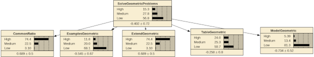

```{r packages}
library(rjags)
library(coda)
library(tidyverse)
```


## Mini-ACED Proficiency Model



Higher-order g-DINA

$$ \text{logit}(P(S_{i,k}=1| \theta_i, \alpha_k, \beta_k) = \alpha_k \theta_k - \beta_k $$


## mini-ACED data

```{r loadData}
MiniACED.EM <- read_csv("MiniACEDEMTable.csv")
MiniACED.data <- read_csv("miniACED-Geometric.csv")
MiniACED.Qmat <- read_csv("miniACED.Qmat.csv")
```


